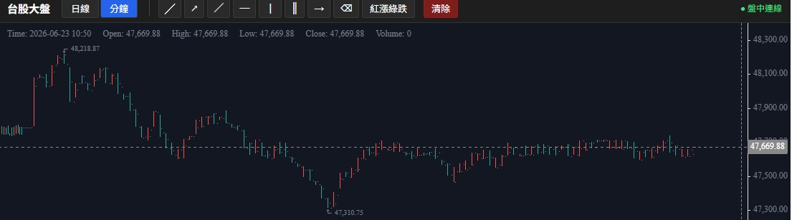
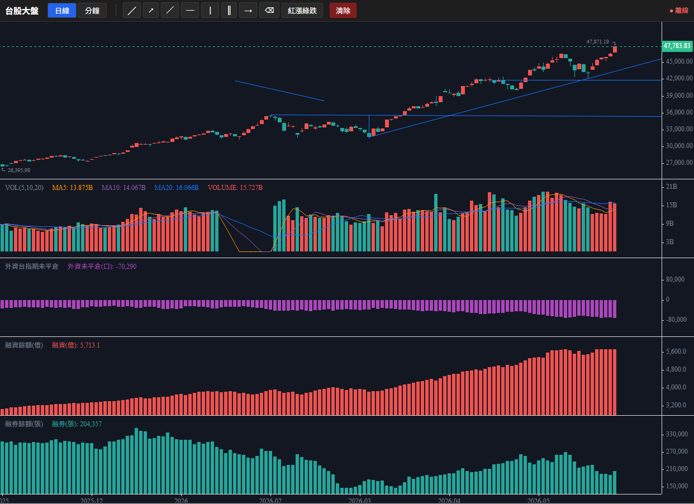

# TAIEX 大盤 K線圖系統

台股大盤指數 K線圖，含成交量、融資融券，盤中即時更新，支援畫線工具。

## 展示




## 功能

- **K線圖**（日線 / 分鐘線）— KLineChart
- **成交量**副圖
- **融資 / 融券**副圖（每日，證交所資料）
- **盤中即時**更新（開盤 09:00-13:30，WebSocket 推播分鐘K）
- **畫線工具**：線段、射線、水平線、畫筆（自由手繪）、箭頭
  - 畫線儲存於瀏覽器 localStorage

## 技術架構

| 層 | 技術 |
|----|------|
| 後端 | Python + FastAPI |
| 資料庫 | DuckDB（列式，適合時序聚合） |
| 前端 | React + TypeScript + Vite |
| 圖表 | KLineChart v9（含畫線工具） |
| 即時推送 | WebSocket |
| 容器 | Docker Compose（開發/正式分離） |

## 資料來源

| 資料 | 來源 | 頻率 |
|------|------|------|
| 日線 OHLC | TWSE OpenAPI `/indicesReport/MI_5MINS_HIST` | 收盤後 |
| 日成交量 | TWSE OpenAPI `/exchangeReport/FMTQIK` | 收盤後 |
| 融資融券 | TWSE OpenAPI `/exchangeReport/MI_MARGN`（全市場合計） | 收盤後 |
| 盤中分鐘K指數 | Yahoo Finance v8 `^TWII` | 盤中每 30s |
| 盤中分鐘量 | TWSE OpenAPI `/exchangeReport/MI_5MINS`（5秒累計差值） | 盤中每 10s |

## 快速開始

### 開發模式

```bash
docker compose -f docker-compose.dev.yml up --build
```

- 後端：http://localhost:8000 （API 文件：http://localhost:8000/docs）
- 前端：http://localhost:5173

### 正式部署（Coolify）

1. 將此 repo 連接到 Coolify
2. Build Pack 選 **Docker Compose**
3. Docker Compose Location 指定 `docker-compose.prod.yml`
4. 在 Coolify UI 為 `frontend` service 指派網域
5. 部署

## 專案結構

```
├── docker-compose.dev.yml     # 開發
├── docker-compose.prod.yml    # 正式（Coolify）
├── backend/                   # FastAPI + DuckDB
│   ├── app/
│   │   ├── main.py
│   │   ├── config.py
│   │   ├── db.py
│   │   ├── twse_client.py
│   │   ├── yahoo_client.py
│   │   ├── scheduler.py
│   │   ├── aggregator.py
│   │   ├── routes/
│   │   └── ws/
│   ├── Dockerfile             # 正式
│   └── Dockerfile.dev         # 開發
└── frontend/                  # React + KLineChart
    ├── src/
    │   ├── components/
    │   ├── hooks/
    │   ├── store/
    │   └── api/
    ├── nginx.conf             # 正式反向代理
    ├── Dockerfile             # 正式
    └── Dockerfile.dev         # 開發
```
